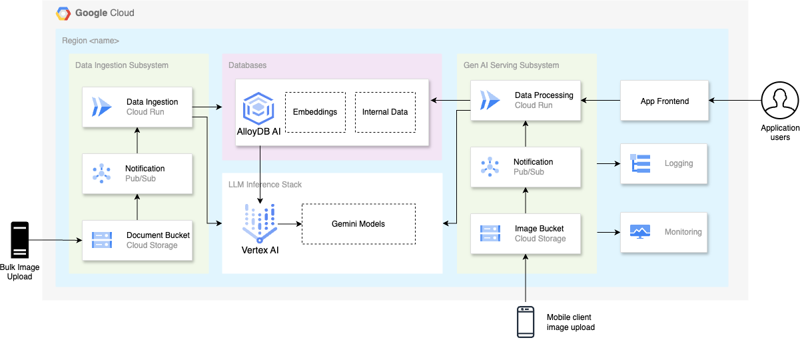

I want you to be an expert gcp architect. Please parse the architecture diagram presented here. Describe the architecture and the flow. Generate infrastructure as code for terraform.




AI
This architecture diagram depicts a Google Cloud platform solution for processing images and generating text from them using a large language model (LLM) such as Gemini.

Here's a breakdown of the architecture:

1. Data Ingestion Subsystem:

Bulk Image Upload: Images are uploaded to a Google Cloud Storage bucket.
Data Ingestion (Cloud Run): Images are ingested into the system via Cloud Run, a serverless platform.
Notification (Pub/Sub): Pub/Sub is used to trigger processing events as new images are uploaded.
2. Databases (AlloyDB AI):

AlloyDB AI: This is a managed relational database service that stores embeddings and internal data.
Embeddings: Embeddings are numerical representations of the images, which capture their semantic meaning.
Internal Data: This might include metadata related to the images (e.g., date, source).
3. LLM Inference Stack:

Vertex AI: This is a managed machine learning service that hosts the LLM (Gemini models).
Gemini Models: The LLM models process the embeddings and internal data to generate text from the images.
4. Gen AI Serving Subsystem:

Data Processing (Cloud Run): After processing by the LLM, the generated text is packaged into a format suitable for delivery to clients.
Notification (Pub/Sub): Pub/Sub is used to signal that text generation is complete.
App Frontend: This could be a web application or a mobile app that displays the generated text to users.
Logging: Logs events related to processing and text generation for monitoring and debugging.
Monitoring: Provides insights into the performance and health of the system.
5. Application Users:

Mobile client image upload: Users can upload images directly to the system from their mobile devices.
The Flow

Users upload images to the Google Cloud Storage bucket.
Cloud Run triggers the ingestion process, which generates embeddings and stores them in AlloyDB AI along with internal data.
Pub/Sub sends a message to Vertex AI to trigger the LLM (Gemini models) for text generation.
Vertex AI processes the embeddings and internal data to generate text.
Cloud Run packages the generated text and sends it to the App Frontend.
The App Frontend displays the generated text to users.
The entire process is monitored and logged for debugging and performance analysis.
Terraform Infrastructure as Code
```
# Create a Google Cloud Storage bucket
resource "google_storage_bucket" "main" {
  name = "image-bucket"
  location = "US"
  uniform_bucket_level_access = true
}

# Create Cloud Run service for image ingestion
resource "google_cloud_run_v2_service" "image_ingestion" {
  name     = "image-ingestion"
  location = "us-central1"
  template {
    containers {
      image = "us-docker.pkg.dev/cloudrun/container/image-ingestion"
      ports {
        container_port = 8080
      }
    }
    timeout_seconds = 120
  }
}

# Create Pub/Sub topic for image processing events
resource "google_pubsub_topic" "image_processing_topic" {
  name = "image-processing-topic"
}

# Create a Cloud Run service for data processing
resource "google_cloud_run_v2_service" "data_processing" {
  name     = "data-processing"
  location = "us-central1"
  template {
    containers {
      image = "us-docker.pkg.dev/cloudrun/container/data-processing"
      ports {
        container_port = 8080
      }
    }
    timeout_seconds = 120
  }
}

# Create a Cloud Function to trigger data processing on Pub/Sub message
resource "google_cloudfunctions2_function" "data_processing_trigger" {
  name     = "data-processing-trigger"
  runtime  = "nodejs16"
  entry_point = "processImage"
  source_archive_bucket = google_storage_bucket.main.name
  source_archive_object  = "data-processing-trigger.zip"
  trigger_http = false
  event_trigger {
    event_type = "google.cloud.pubsub.topic.v1.messagePublished"
    resource  = google_pubsub_topic.image_processing_topic.name
  }
}

# Create an AlloyDB instance
resource "google_alloydb_instance" "main" {
  name         = "alloydb-instance"
  region       = "us-central1"
  database_version = "POSTGRES_14"
  size = "BASIC"
  disk_autoresize = true
  backup_configuration {
    enabled = true
    retention_period = "720h"
  }
}

# Create a Vertex AI endpoint for the LLM (Gemini models)
resource "google_vertex_ai_endpoint" "gemini" {
  name     = "gemini-endpoint"
  location = "us-central1"
}

# Create a Cloud Run service for the App Frontend
resource "google_cloud_run_v2_service" "app_frontend" {
  name     = "app-frontend"
  location = "us-central1"
  template {
    containers {
      image = "us-docker.pkg.dev/cloudrun/container/app-frontend"
      ports {
        container_port = 8080
      }
    }
    timeout_seconds = 120
  }
}
```
This Terraform code defines the core infrastructure components of the architecture. However, it does not include the specific logic for image ingestion, text generation, and application frontend. These would typically be implemented within the Docker containers for each Cloud Run service and the Cloud Function.

To complete the infrastructure, you would:

Build the Docker images: Create Dockerfiles to define the image ingestion, data processing, and App Frontend containers, including the necessary libraries and configurations.
Deploy the Docker images: Push the built Docker images to a Container Registry (e.g., Google Container Registry).
Develop the Cloud Function: Write the Node.js code for the Cloud Function, which will listen for Pub/Sub events and trigger the data processing Cloud Run service.
Remember to adjust the Terraform code and the application logic to match your specific requirements and use cases.
